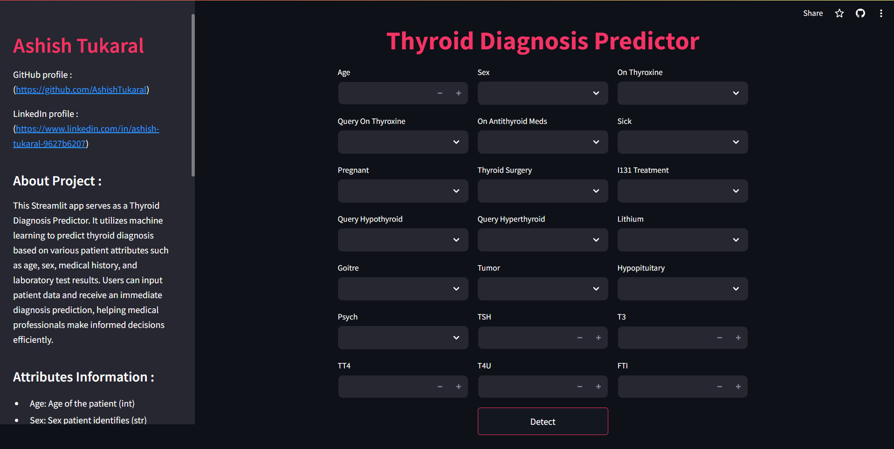
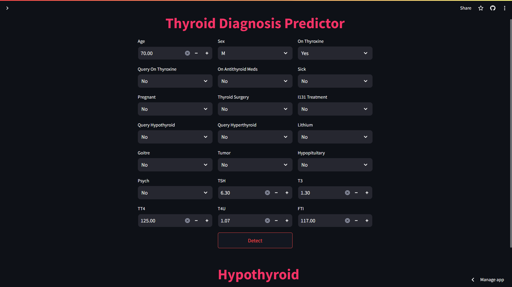

# Thyroid Detection App using Streamlit

## Table of Contents

1. [Solving Thyroid Diagnosis Challenges](#solving-thyroid-diagnosis-challenges)
2. [Why Thyroid Diagnosis Matters](#why-thyroid-diagnosis-matters)
3. [How Our Application Helps](#how-our-application-helps)
4. [Key Features](#key-features)
5. [Project Structure](#project-structure)
6. [Process to Run](#process-to-run)
7. [Attributes Information](#attributes-information)
8. [Note](#note)

## Solving Thyroid Diagnosis Challenges

Thyroid disorders affect millions of people worldwide, presenting a significant challenge for healthcare professionals in accurately diagnosing and managing these conditions. With the Thyroid Detection App using Streamlit, we aim to streamline the diagnostic process and empower healthcare professionals to make informed decisions quickly and effectively.

## Why Thyroid Diagnosis Matters

Thyroid disorders, including hypothyroidism and hyperthyroidism, can have a profound impact on an individual's health and quality of life. However, diagnosing these conditions can be complex, often requiring a combination of patient history, physical examination, and laboratory tests. Our application seeks to simplify this process by leveraging machine learning technology to provide accurate diagnosis predictions based on patient data.

## How Our Application Helps

The Thyroid Detection App using Streamlit utilizes a machine learning model trained on a comprehensive dataset of patient records to predict thyroid diagnoses with high accuracy. By inputting patient information such as age, sex, medical history, and laboratory test results, healthcare professionals can generate instant diagnosis predictions, enabling timely intervention and treatment.

## Screenshots

Screenshot 1


Screenshot 2


## Key Features

- **Efficiency:** Instant diagnosis predictions save time and facilitate faster patient care.
- **Accuracy:** Our machine learning model is trained on high-quality data and evaluated for accuracy and reliability.
- **Accessibility:** Accessible via a user-friendly web interface built with Streamlit, our application can be used anytime, anywhere, with internet connectivity.

## Project Structure

```
.
├── Streamlit_app.py         # Streamlit application code
├── model.pkl                # Serialized machine learning model
├── model_code.ipynb         # Jupyter notebook containing model training code
├── README.md                # Project documentation
├── requirements.txt         # List of dependencies
├── train_data.csv           # Dataset used for training the model
├── test_data.csv            # Dataset used for testing the model
└── thyroidDF.csv            # Original dataset
```

## Process to Run

1. **Train and Pickle Model:**
   - Open `model_code.ipynb` in Jupyter Notebook or any compatible environment.
   - Execute the code cells to train the machine learning model using `train_data.csv`.
   - Serialize the trained model and save it as `model.pkl`.

2. **Run Streamlit Application:**
   - Open your terminal.
   - Navigate to the project directory.
   - Install dependencies by running:
     ```
     pip install -r requirements.txt
     ```
   - Execute the following command to run the Streamlit application:
     ```
     streamlit run Streamlit_app.py
     ```

## Attributes Information

- **Age:** Age of the patient (numeric)
- **Sex:** Sex of the patient (categorical: 'M' for male, 'F' for female)
- **On Thyroxine:** Whether the patient is on thyroxine medication (binary: 'Yes' or 'No')
- **Query on Thyroxine:** Whether the patient is querying about thyroxine medication (binary: 'Yes' or 'No')
- **On Antithyroid Meds:** Whether the patient is on antithyroid medication (binary: 'Yes' or 'No')
- **Sick:** Whether the patient is sick (binary: 'Yes' or 'No')
- **Pregnant:** Whether the patient is pregnant (binary: 'Yes' or 'No')
- **Thyroid Surgery:** Whether the patient has undergone thyroid surgery (binary: 'Yes' or 'No')
- **I131 Treatment:** Whether the patient is undergoing I131 treatment (binary: 'Yes' or 'No')
- **Query Hypothyroid:** Whether the patient believes they have hypothyroidism (binary: 'Yes' or 'No')
- **Query Hyperthyroid:** Whether the patient believes they have hyperthyroidism (binary: 'Yes' or 'No')
- **Lithium:** Whether the patient is taking lithium medication (binary: 'Yes' or 'No')
- **Goitre:** Whether the patient has goitre (binary: 'Yes' or 'No')
- **Tumor:** Whether the patient has a tumor (binary: 'Yes' or 'No')
- **Hypopituitary:** Whether the patient has hypopituitarism (binary: 'Yes' or 'No')
- **Psych:** Whether the patient has psychiatric issues (binary: 'Yes' or 'No')
- **TSH:** Thyroid-stimulating hormone level in blood (numeric)
- **T3:** Triiodothyronine level in blood (numeric)
- **TT4:** Total thyroxine level in blood (numeric)
- **T4U:** Thyroxine utilization rate in blood (numeric)
- **FTI:** Free thyroxine index in blood (numeric)

## Note

The Thyroid Detection App using Streamlit is intended for educational and informational purposes only and should not replace professional medical advice, diagnosis, or treatment. Always consult with a qualified healthcare provider for any medical concerns or questions.

---

This version includes a table of contents to provide easy navigation and access to different sections of the README. If you have any further questions or need additional information, feel free to ask!
